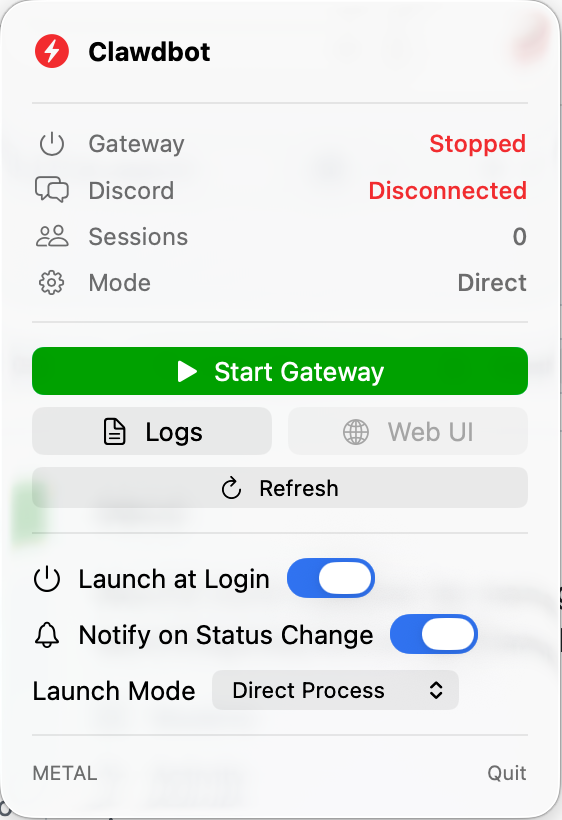
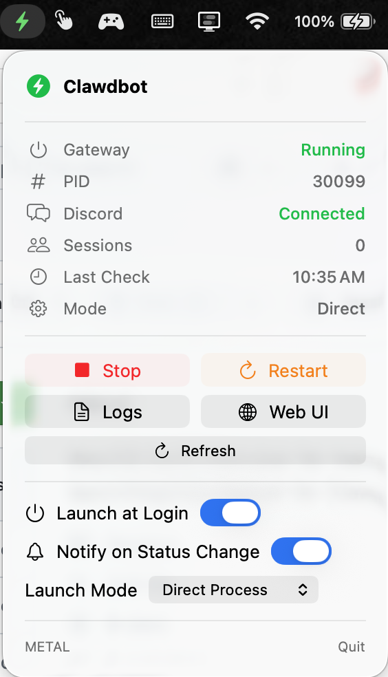

# ClawdbotMenu - macOS Menu Bar App

A macOS menu bar app for monitoring and controlling the [Clawdbot](https://clawd.bot) gateway.

> **Note:** This is a basic first version - doesn't even have an app icon yet!

<p align="center">
  
  
</p>

## Features

- Menu bar icon with color-coded status (green/yellow/red/gray)
- Gateway status display (Running/Stopped/Unknown)
- PID display when running
- Discord connection status (primary use case - other providers not yet supported)
- Sessions count
- Last check timestamp
- Start/Stop/Restart gateway controls
- View Logs button
- Open Web UI button
- Refresh button
- Launch at Login toggle
- Notifications toggle

### Launch Modes

The app supports two launch modes:

- **Direct Process** (default): Spawns the gateway as a child process. Simple and works out of the box.
- **launchd Service**: Installs a launchd user agent (`com.clawdbot.gateway`) that auto-starts on login and auto-restarts on crash.

### Path Auto-Detection

The app automatically detects:
- **Node.js**: Via `which node`, Homebrew (`/opt/homebrew/bin/node`), NVM, or common paths
- **Clawdbot**: Via `which clawdbot` or common installation locations

If paths cannot be detected, the app displays a warning in the menu.

## Build & Run

```bash
cd /path/to/clawdbot-menubar

# Build the .app bundle
./build-app.sh

# Run the app
open ClawdbotMenu.app
```

## Install

1. Run `./build-app.sh`
2. Move `ClawdbotMenu.app` to `/Applications`
3. Launch from Applications or Spotlight

## Configuration

The app auto-detects Node.js and clawdbot paths. No manual configuration required.

**Gateway arguments:** `gateway --port 18789 --allow-unconfigured`

**Logs:** `~/.clawdbot/logs/gateway.log`

**launchd plist (when using launchd mode):** `~/Library/LaunchAgents/com.clawdbot.gateway.plist`

## File Structure

```
ClawdbotMenu/
├── Package.swift
├── README.md
├── build-app.sh
└── ClawdbotMenu/
    ├── ClawdbotMenuApp.swift    # Main app, AppState, gateway control logic
    ├── MenuBarView.swift        # SwiftUI menu bar UI
    └── LaunchAtLoginManager.swift
```

## Technical Details

- Built with SwiftUI and Swift Package Manager
- Requires macOS 14+
- Uses `LSUIElement=true` (no dock icon, menu bar only)
- Status detection via port check (lsof on port 18789)
- Async process management to prevent UI blocking
- Supports both direct process spawning and launchd service management

## Links

- [Clawdbot Website](https://clawd.bot)
- [Clawdbot GitHub](https://github.com/clawdbot/clawdbot)
- [Clawdbot Documentation](https://docs.clawd.bot)

## Credits

[Clawdbot](https://github.com/clawdbot/clawdbot) was created by [@steipete](https://x.com/steipete).

This menu bar app was created by [@magimetal](https://x.com/magimetal).

## Contributing

Contributions are welcome! Feel free to open issues or submit PRs.

## License

MIT License - do whatever you want with this.
